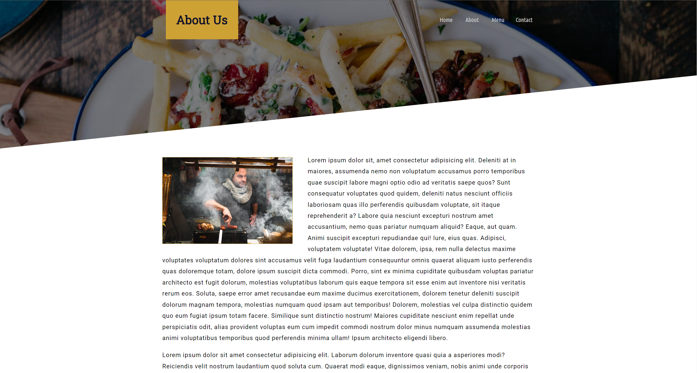
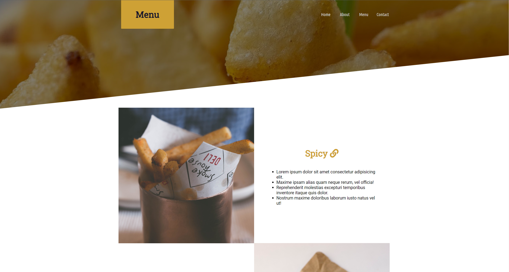
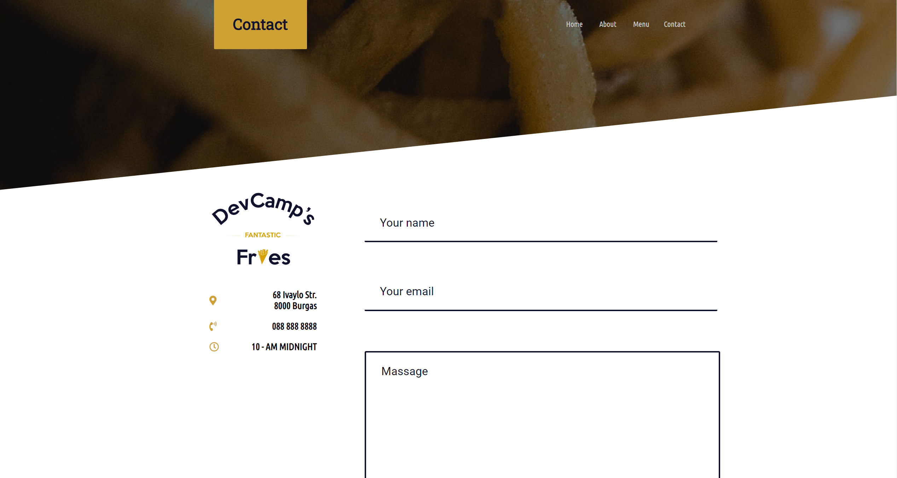

# Fries Web App

Fries App is the first static app I created after completing a HTML/CSS course in Udemy.

## Technologies used

Fries web app was built using the following technologies:

- HTML: plain HTML for markup
- CSS: plain CSS for styling

## Deployment

[Fries Web Application](https://stanimir-p.github.io/Snake-React/)